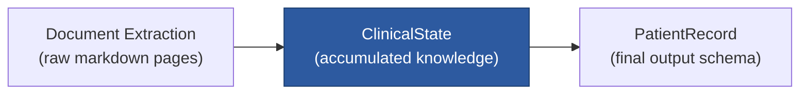
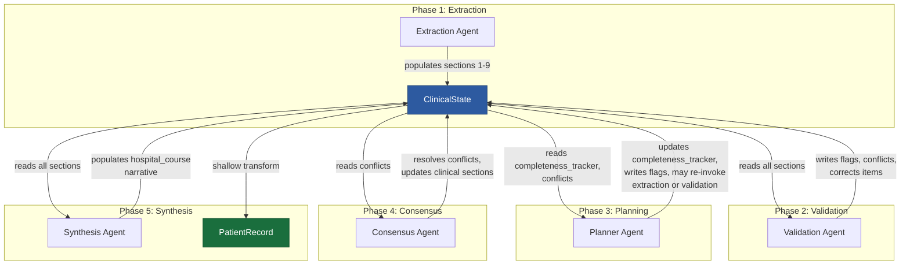

# ClinicalState Architecture Design

## 1. Role and Positioning

The **ClinicalState** is the patient-centric intermediate knowledge representation that lives between raw document extraction and the final `PatientRecord` output schema. It is the single shared object that flows through the agent graph. Every agent reads from it, reasons over it, and writes back into it.



> [!IMPORTANT]
> ClinicalState contains **only clinical knowledge about the patient**. It does NOT contain raw document pages, extracted markdown text, workflow execution details, or agent runtime metadata. Those belong to separate orchestration-layer structures.

---

## 2. Top-Level Structure

The ClinicalState mirrors the 10 clinical sections of `PatientRecord` one-to-one, but wraps each section in reasoning-aware containers that carry evidence, conflicts, and completeness information. It also adds two internal sections for reasoning support.

```
ClinicalState
│
├── case_id                          # Unique identifier for this patient case
├── schema_version                   # ClinicalState schema version
│
│  ── CLINICAL KNOWLEDGE SECTIONS ──
│
├── patient_details                  # Section 1: Demographics & identifiers
├── admission_details                # Section 2: Admission context
├── diagnoses                        # Section 3: All diagnostic findings
├── procedures                       # Section 4: Surgical / interventional
├── investigations                   # Section 5: Labs, radiology, pathology
├── medications                      # Section 6: Medication lifecycle
├── hospital_course                  # Section 7: Narrative timeline
├── discharge_status                 # Section 8: Condition at discharge
├── follow_up                        # Section 9: Post-discharge plan
├── flags                            # Section 10: Clinical & data quality flags
│
│  ── REASONING SUPPORT SECTIONS ──
│
├── conflicts                        # Section 11: Unresolved contradictions
└── completeness_tracker             # Section 12: Section-level readiness map
```

---

## 3. Section Design Principles

### 3.1 Structural Alignment with PatientRecord

Each of the 10 clinical sections uses a field name **identical** to its counterpart in `PatientRecord`. This is intentional — the final synthesis step should be a shallow transformation, not a restructuring.

| ClinicalState Section | PatientRecord Section | Structural Relationship |
|---|---|---|
| `patient_details` | `patient_details` | Same nested shape |
| `admission_details` | `admission_details` | Same nested shape |
| `diagnoses` | `diagnoses` | Same list structure |
| `procedures` | `procedures` | Same list structure |
| `investigations` | `investigations` | Same list structure |
| `medications` | `medications` | Same list structure |
| `hospital_course` | `hospital_course` | Same nested shape |
| `discharge_status` | `discharge_status` | Same nested shape |
| `follow_up` | `follow_up` | Same nested shape |
| `flags` | `flags` | Same list structure |
| `conflicts` | *(no counterpart)* | Reasoning-only; consumed before synthesis |
| `completeness_tracker` | *(no counterpart)* | Reasoning-only; consumed before synthesis |

### 3.2 Items Already Carry Evidence and Confidence

The existing `ClinicalBase` parent class already provides `evidence: List[Evidence]` and `confidence: Optional[Confidence]` on every clinical entity (Diagnosis, Medication, Procedure, etc.). **This is the correct design.** The ClinicalState reuses these same models directly — it does not need a separate evidence layer wrapping each item.

This means individual clinical items inside the ClinicalState already support:
- **Traceability**: Which page, document, and section the data came from
- **Confidence scoring**: How certain the system is about the extracted value
- **Auditability**: Who/what created or modified the item

No additional wrapping is needed at the item level.

### 3.3 Extensibility Strategy

The top-level section names are **stable and frozen**. They will not change. However, the nested models inside each section (e.g., what fields `Diagnosis` or `Medication` carry) are free to evolve. New Optional fields can be added to any clinical model without breaking existing agents or state serialization.

---

## 4. Detailed Section Purposes

### Section 1: `patient_details`
**Type**: `Optional[PatientDetails]`
**Purpose**: Core patient demographics and identifiers. Populated early. Rarely conflicting.
**Populated by**: Extraction Agent (from cover sheets, admission forms)
**Extensibility**: Future fields like `blood_group`, `emergency_contact`, `insurance_id` can be added to the `PatientDetails` model.

### Section 2: `admission_details`
**Type**: `Optional[AdmissionDetails]`
**Purpose**: Admission context including dates, physicians, chief complaints.
**Populated by**: Extraction Agent
**Extensibility**: Fields like `admission_type` (emergency, elective), `ward_transfers`, `bed_number` can be added.

### Section 3: `diagnoses`
**Type**: `List[Diagnosis]`
**Purpose**: All diagnostic findings across the hospitalization. Supports primary, secondary, comorbidity, and discharge diagnoses.
**Populated by**: Extraction Agent (initial), Validation Agent (classification corrections), Consensus Agent (conflict resolution between contradictory diagnoses)
**Extensibility**: The `Diagnosis` model can gain fields like `icd_version`, `laterality`, `body_site`.

### Section 4: `procedures`
**Type**: `List[Procedure]`
**Purpose**: Surgical and interventional procedures performed during the stay.
**Populated by**: Extraction Agent
**Extensibility**: Fields like `anesthesia_type`, `duration_minutes`, `surgeon_name` can be added.

### Section 5: `investigations`
**Type**: `List[Investigation]`
**Purpose**: Laboratory results, radiology reports, pathology findings, and other diagnostic tests.
**Populated by**: Extraction Agent (values from investigation sheets), Validation Agent (flagging abnormal results)
**Extensibility**: Fields like `specimen_type`, `ordering_physician`, `critical_flag` can be added.

### Section 6: `medications`
**Type**: `List[Medication]`
**Purpose**: Complete medication lifecycle: started, modified, stopped, continued at discharge.
**Populated by**: Extraction Agent (from drug charts, nursing notes), Validation Agent (dose verification), Consensus Agent (reconciling conflicting med lists across pages)
**Extensibility**: Fields like `brand_name`, `form` (tablet, injection), `prn_flag` can be added.

### Section 7: `hospital_course`
**Type**: `Optional[HospitalCourse]`
**Purpose**: Narrative reconstruction of the hospitalization timeline including key clinical events, complications, and treatment responses.
**Populated by**: Extraction Agent (raw events from nursing notes), Synthesis Agent (narrative summarization). This is typically one of the last sections to be fully populated because it requires information from nearly all other sections.
**Extensibility**: The `Event` model can gain fields like `event_category`, `severity`, `related_diagnosis_id`.

### Section 8: `discharge_status`
**Type**: `Optional[DischargeStatus]`
**Purpose**: Patient condition at discharge. Functional, cognitive, and mobility assessments.
**Populated by**: Extraction Agent (from discharge summary sheets)
**Extensibility**: Fields like `pain_level_at_discharge`, `wound_status`, `device_at_discharge` can be added.

### Section 9: `follow_up`
**Type**: `Optional[FollowUp]`
**Purpose**: Post-discharge plan including appointments, medication instructions, monitoring, and return precautions.
**Populated by**: Extraction Agent
**Extensibility**: Fields like `referral_documents`, `home_care_instructions` can be added.

### Section 10: `flags`
**Type**: `List[Flag]`
**Purpose**: Both clinical safety flags (critical lab values, allergy conflicts) and data quality flags (missing information, unreadable sections, contradictions).
**Populated by**: Validation Agent (clinical flags), Planner Agent (data quality flags from completeness checks), Consensus Agent (unresolvable conflicts)
**Extensibility**: The `Flag` model can gain fields like `auto_resolvable`, `resolution_suggestion`, `linked_section`.

### Section 11: `conflicts` (Reasoning-Only)
**Type**: `List[Conflict]`
**Purpose**: Tracks contradictory information found across different pages or sections of the source documents. For example, one page says "Amoxicillin 500mg" and another says "Amoxicillin 250mg". Conflicts are stored here for the Consensus Agent to evaluate and resolve. Once resolved, the winning value is written into the appropriate clinical section and the conflict entry is marked as resolved.
**Populated by**: Validation Agent (detection), Consensus Agent (resolution)
**Not present in PatientRecord**: Unresolved conflicts are converted to `Flag` entries during final synthesis. Resolved conflicts are discarded (the winning value is already in the clinical section).

**Conflict structure** (conceptual):
```
Conflict:
    conflict_id: str
    section: str              # e.g., "medications", "diagnoses"
    field_path: str           # e.g., "medications[2].dose"
    competing_values: List[CompetingValue]
    resolution_status: "unresolved" | "resolved" | "deferred"
    resolved_value: Optional[Any]
    resolved_by: Optional[str]
    resolution_reasoning: Optional[str]

CompetingValue:
    value: Any
    evidence: Evidence
    confidence: Confidence
```

### Section 12: `completeness_tracker` (Reasoning-Only)
**Type**: `Dict[str, SectionStatus]`
**Purpose**: A per-section readiness map that planners and agents use to determine what information is present, missing, or needs further work. This is NOT workflow metadata — it is a clinical completeness assessment (e.g., "we have no discharge date yet" is clinical knowledge, not orchestration state).
**Populated by**: Planner Agent (assessments), Validation Agent (updates after verification passes)
**Not present in PatientRecord**: Missing information signals are converted to `Flag` entries during final synthesis.

**SectionStatus structure** (conceptual):
```
SectionStatus:
    status: "empty" | "partial" | "complete" | "verified"
    missing_fields: List[str]       # e.g., ["discharge_date", "attending_physician"]
    last_updated_by: str            # Agent name
    last_updated_at: datetime
    notes: Optional[str]
```

---

## 5. Agent Responsibilities Matrix

This matrix shows which agents are expected to interact with which ClinicalState sections.

| Section | Extraction Agent | Validation Agent | Consensus Agent | Planner Agent | Synthesis Agent |
|---|:---:|:---:|:---:|:---:|:---:|
| `patient_details` | **W** | R | — | R | R |
| `admission_details` | **W** | R | — | R | R |
| `diagnoses` | **W** | **R/W** | **R/W** | R | R |
| `procedures` | **W** | R | — | R | R |
| `investigations` | **W** | **R/W** | — | R | R |
| `medications` | **W** | **R/W** | **R/W** | R | R |
| `hospital_course` | **W** | R | — | R | **R/W** |
| `discharge_status` | **W** | R | — | R | R |
| `follow_up` | **W** | R | — | R | R |
| `flags` | — | **W** | **W** | **W** | R |
| `conflicts` | — | **W** | **R/W** | R | R |
| `completeness_tracker` | — | **W** | — | **R/W** | R |

**Legend**: **W** = primary writer, **R/W** = reads and may modify, **R** = reads only, **—** = no interaction

---

## 6. Data Flow Through the Agent Graph



---

## 7. Supporting Planner Decisions

The Planner Agent needs to answer three questions at any point in the pipeline:

### Question 1: "What is missing?"
**Answer source**: `completeness_tracker`. The planner reads the `missing_fields` list for each section. If `patient_details` has `status: "partial"` with `missing_fields: ["date_of_birth", "address"]`, the planner knows exactly what to look for.

### Question 2: "What is uncertain?"
**Answer source**: Confidence scores on individual items. The planner can scan all clinical items and identify anything with `confidence.confidence_score < threshold`. These items may need re-extraction or a second agent pass.

### Question 3: "What is contradictory?"
**Answer source**: `conflicts` section. Any entry with `resolution_status: "unresolved"` represents a contradiction that the Consensus Agent has not yet addressed. The planner can decide whether to invoke the Consensus Agent, request human review, or defer.

These three query patterns give the planner complete visibility into the state of clinical knowledge without needing to understand the internals of any specific section.

---

## 8. Final Synthesis: ClinicalState → PatientRecord

Because the ClinicalState mirrors the PatientRecord structure at the top level and reuses the exact same Pydantic models for clinical entities, the final transformation is computationally trivial:

```
For each of the 10 clinical sections:
    1. Copy the section directly from ClinicalState to PatientRecord
       (same types, same field names → direct assignment)

For conflicts:
    2. Any unresolved conflicts → convert to Flag entries in PatientRecord.flags

For completeness_tracker:
    3. Any sections with status "partial" or "empty" → convert to 
       data quality Flag entries in PatientRecord.flags

For evidence_map and confidence_metadata in PatientRecord:
    4. Aggregate from the individual item-level evidence and confidence 
       already present on each ClinicalBase entity (these are already there)

For processing_metadata:
    5. Populated by the orchestration layer (not by ClinicalState)
```

> [!TIP]
> The synthesis step should require **zero LLM calls**. It is a pure data transformation. All reasoning, extraction, reconciliation, verification, and conflict resolution has already been completed by the agents operating on the ClinicalState.

---

## 9. What ClinicalState Explicitly Does NOT Contain

| Excluded Concern | Where It Belongs |
|---|---|
| Raw PDF pages or image paths | Orchestration / Pipeline state |
| Extracted markdown text | Extraction output store (`data/structured_json/`) |
| Agent execution logs | Orchestration / observability layer |
| Agent task queues or schedules | Planner / orchestrator runtime |
| LLM prompt templates | Agent implementation code |
| API keys or configuration | Environment / config layer |
| Performance metrics | Observability / monitoring layer |

---

## 10. Summary of Design Decisions

| Decision | Rationale |
|---|---|
| ClinicalState mirrors PatientRecord's 10 sections | Minimizes synthesis complexity to a shallow copy |
| Reuses existing `ClinicalBase`-derived models | Evidence and confidence are already embedded per-item; no wrapping needed |
| Top-level sections are stable and frozen | Agents can rely on section names for routing and planning |
| Nested models are extensible via Optional fields | New clinical detail can be added without schema version breaks |
| `conflicts` section is reasoning-only | Contradictions must be tracked during reasoning but do not belong in the final output |
| `completeness_tracker` is reasoning-only | Planner needs structured completeness data, but the final output uses Flag entries instead |
| Synthesis requires zero LLM calls | All intelligence is spent during the agent graph traversal, not at output time |
| LLM/provider agnostic | No model names, API references, or provider-specific types anywhere in the schema |
